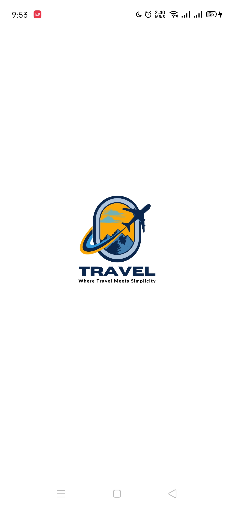
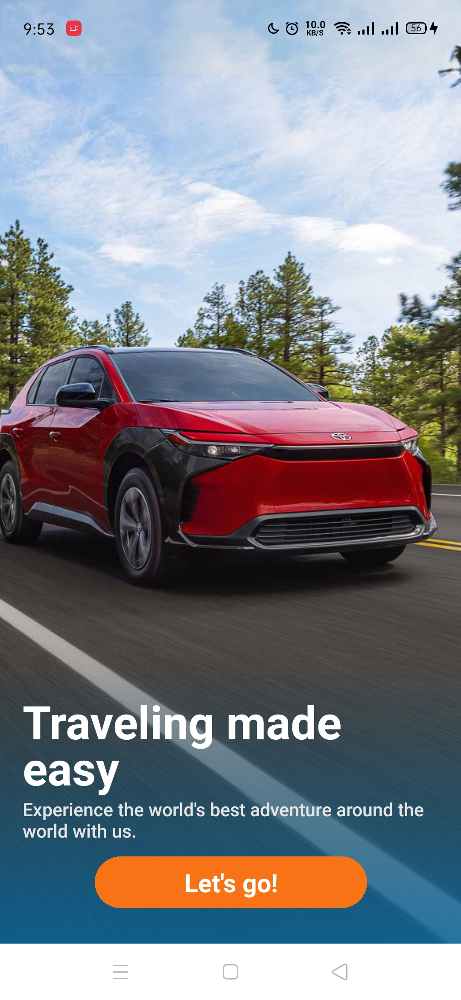
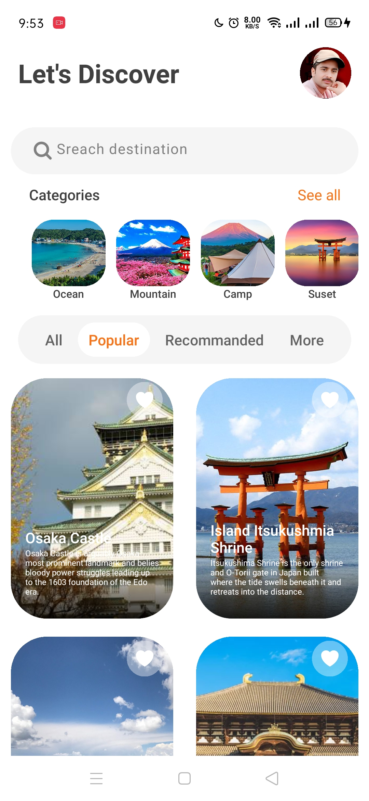
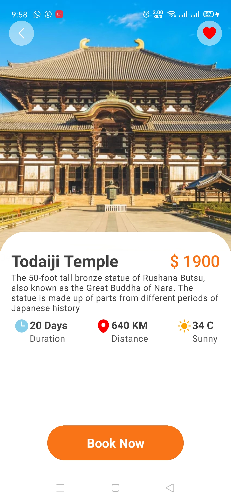

# travelApp
## A simple travel app built with React Native (Expo) 
## Features
### SplashScreen

### WelcomeScreen

### HomeScreen

### DestinationScreen.

### Dependencies 

- "@react-navigation/native": "^7.0.14",
 - "@react-navigation/native-stack": "^7.2.0",
  - "@react-navigation/stack": "^7.1.1",
   - "expo": "^52.0.24",
   - "expo-linear-gradient": "^14.0.1"
   - "-expo-status-bar": "~2.0.0",
- "nativewind": "^4.1.23",
- "react": "18.3.1",
- "react-native": "0.76.5"
- "react-native-gesture-handler": "~2.20.2",
- "react-native-heroicons": "^4.0.0"
- "react-native-reanimated": "~3.16.1",
- "react-native-responsive-screen": "^1.4.2",
- "react-native-safe-area-context": "^4.12.0",
 - "react-native-screens": "~4.4.0",
  - "react-native-svg": "^15.11.1",
   - "react-native-vector-icons": "^10.2.0"
   - "tailwindcss": "^3.4.17"

### To Install Dependencies just use command below.
npm i (dependencies name)
Example

npm i "react-native-responsive-screen": "^1.4.2",